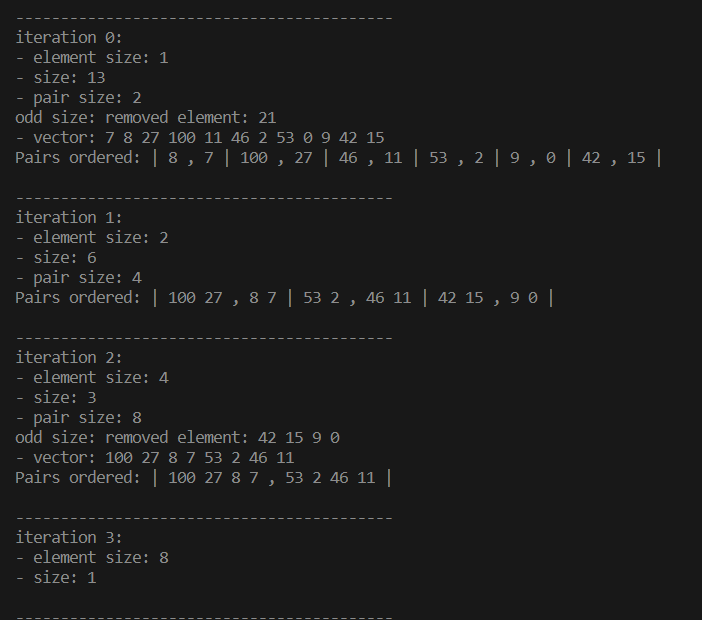
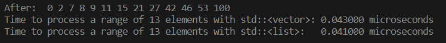

# Merge Insertion Sort
Its objective is to perform as few comparisons as possible to sort an unsorted set of elements.

It has some steps similar to merge sort and insertion sort algorithms, but also more specific steps.

#### Merge Sort
- a divide and conquer algorithm
- split the given array in two parts and sort them individually (recursively divide and sort)
- Merges the both sorted halves.

#### Insertion Sort
- Split the array into sorted and unsorted part.
- Insert each element from the unsorted part to its correct position in the sorted part

## Ford-Johnson algorithm: Merge Insertion Sort
- First part: before recursion:
1. If the number of elements is odd, leave one element out

#### "Merge" part:
2. Make pairwise comparisons of n/2 disjoint pairs of elements
3. Sort the n/2 larger numbers, found in step (2), by merge insertion (recursion - back to step 1).
Here it is crucial to maintain the link between each individually sorted pair!!

Example: `7 8 27 100 11 46 2 53 0 9 42 15 21`


- Second Part: after recursion (when half of the elements are sorted)
#### "Insert" part:
4. Separate the sorted part (the n/2 larger numbers) and the unsorted part (the n/2 unsorted smaller numbers):
a1, a2, . . . , a[n/2] and b1, b2, . . . , b[n/2] where:
- a1 ≤ a2 ≤ · · · ≤ a[n/2] (the sorted part: the main chain)
- bi ≤ ai for 1 ≤ i ≤ n/2 (the links created in step 2: pend)
5. Add at the unordered part the element removed in step (1) if the case
6. Insert b1 in the main chain (it's smaller than a1, so it will be the first element in the main chain)

Example for steps 4, 5 and 6:


7. Insert the remaining b’s into the main chain, using [binary
insertion](https://en.wikipedia.org/wiki/Binary_search_algorithm), in an pre-determined optimized order using the Jacobsthal sequence to make as few comparisons as possible

All the steps of the second part for `std::vector`:


All the steps of the second part for `std::list`:


### Performance results:


With 1000 elements:


With 3000 elements:


With 10.000 elements:


With 100.000 elements: :upside_down:


### Running the code
```bash
git clone https://github.com/sgkhusal/42-CPP.git cpp
cd cpp/cpp09/ex02
make
./PmergeMe <your sequence to order>
```

If you want to run in debug mode (with the steps printing above - I do not recomend for larger number of elements since it is a lot of printing), uncomment the debug flag `-D DEBUG=true` in Makefile and run `make re` to recompile the code with the flag


## References

1. [Containers](https://legacy.cplusplus.com/reference/stl/)
2. The Art of Computer Programming - Vol. 3 - Sorting and Searching - Knuth, DONALD E.
(item 5.3.1 - Minimum-Comparison Sorting)
3. [Merge-insertion sort](https://en.wikipedia.org/wiki/Merge-insertion_sort)
4. [Ford-Johnson-algorithm](https://github.com/nerraou/Ford-Johnson-algorithm/tree/master)
5. [ford-johnson-merge-insertion-sort](https://github.com/PunkChameleon/ford-johnson-merge-insertion-sort)
6. [Ford-Johnson merge-insertion sort](https://codereview.stackexchange.com/questions/116367/ford-johnson-merge-insertion-sort#:~:text=The%20Ford%2DJohnson%20algorithm%2C%20also,possible%20to%20sort%20a%20collection.)
7. [cpp-sort](https://github.com/Morwenn/cpp-sort/tree/1.x.y-stable)
8. [C++ benchmark – std::vector VS std::list VS std::deque](https://baptiste-wicht.com/posts/2012/12/cpp-benchmark-vector-list-deque.html)
8. [std::advance](https://cplusplus.com/reference/iterator/advance/)
9. [Is there ever a reason to use std::list?](https://stackoverflow.com/questions/18449038/is-there-ever-a-reason-to-use-stdlist)
10. [Why is it so slow iterating over a big std::list?](https://stackoverflow.com/questions/1402483/why-is-it-so-slow-iterating-over-a-big-stdlist)
11. [Does anybody use std::list?](https://www.reddit.com/r/cpp/comments/jf3dwo/does_anybody_use_stdlist/)

